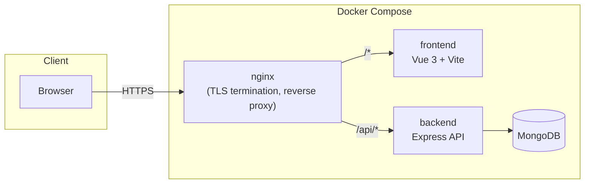

# Timesheets

A team time-tracking, approval, and invoicing application. Members log time against clients' projects and tasks, managers review and approve it, and approved time flows into personal invoices that can be rolled up into a single collective invoice per client — with per-person VAT/tax handling for teams mixing employees and independent contractors.

## Features

**Teams & access**
- Multi-team membership — a user can belong to several teams, each with its own manager/member role and hourly rate
- Manager-controlled invitations, role changes, and per-member billing rates
- Email verification, password reset, JWT access/refresh token auth with rotation

**Clients, projects & tasks**
- Clients with billing details and tax ID, scoped per team
- Projects with status (active/on hold/complete/cancelled), currency, optional date range, hourly rate, and budget tracking (hours or monetary)
- Tasks per project with a status (open/in progress/complete), their own optional rate override, assignee, and a manager-only, server-enforced billable flag (default: billable) — the single point of control for whether time logged against it can be invoiced
- Time can't be logged, or an existing entry reassigned, against a completed task — enforced server-side, and completed tasks are hidden from the time-entry task picker

**Time tracking**
- Weekly grid entry with mandatory project + task selection and notes — a time record's billable status is never set directly; it's inherited from its task as an immutable snapshot at creation (same pattern as its resolved rate/currency), so a manager always controls what's billable rather than each entry deciding for itself
- Hard overlap prevention — a user can't log two overlapping entries on the same day, even across different teams
- Entries can't be logged outside a project's active date range
- Rate resolution with clear precedence: a member's own rate wins over the generic task/project rate, and a more specific override wins over a less specific one — member's task-level override → member's project-level override → member's flat team rate → task's flat rate → project's flat rate. A reassignment re-resolves the rate under this order. A non-billable task always resolves to $0, skipping this precedence entirely regardless of what rates are configured anywhere
- Managers can override a specific member's rate per project, or per task within a project, from the project page — without touching that member's flat team-wide rate
- Filters by project, task, billable status, and approval status, plus a jump-to-date picker
- Optional cross-team view: see your own time logged in every team you belong to (read-only outside the currently selected team), useful for understanding cross-team overlap blocks

**Approvals**
- Manager approval queue for pending entries, with rejection reasons
- Approved entries lock automatically; managers can revert an approval back to pending as long as the entry hasn't been pulled into a personal invoice yet

**Invoicing**
- Two-tier model: personal invoices (one team member, one project) roll up into collective invoices (one client, spanning every project that client has)
- A collective invoice only pools *sent* personal invoices — never raw time records directly — so each contributor controls what they've billed before it's consolidated
- Each personal invoice carries its own tax rate (e.g. VAT), chosen at creation time; a collective invoice has no tax rate of its own — it simply totals what each pooled personal invoice already billed, at that person's own rate
- Contractors can attach incorporation details (company name, address, tax ID, phone) to their profile, printed on invoice exports; a collective invoice prints the creating manager's incorporation details and requires them to be a contractor with a complete profile
- Two separate bank accounts per user — personal (for a member's own invoices) and collective (for invoices a manager issues on the team's behalf) — supporting both EU (IBAN/SWIFT) and North American (routing/account number) formats, plus a free-text fallback; creating a collective invoice is blocked until the manager's collective account is complete
- EU/North America compliance fields: due date, payment terms (e.g. "Net 30"), and a free-text tax/legal note (e.g. a reverse-charge mention); a personal invoice's supply/service period is auto-derived from the dates of its included time records, never manually entered
- Sequential, human-readable invoice numbers (`yyyymmdd-NNNNNN`, per team, never reused)
- A personal invoice's line items read "date, project, task" (a collective invoice's stay as the pooled personal invoice's own number); the quantity column is labeled "Units" everywhere; Payment details prints in the PDF's header, right-justified below Period, above the line items rather than after the totals
- Draft → sent → paid/partially paid/overdue lifecycle, with the ability to revert a sent (not yet paid, not yet pooled) invoice back to draft
- PDF and CSV export, including payment/bank details, due date, payment terms, and tax note, with full Unicode font support (Polish, and other Latin-Extended-A text render correctly, unlike PDFKit's default fonts)

**Reporting**
- Team time/cost summaries by project, by task, and by user, with CSV/PDF export

**Audit log**
- Immutable, per-team audit trail of team-member/project/task rate changes and time record approvals/reversions/rejections/invoice generation, each entry denormalized with actor and entity names at write time so it stays readable even if a project or user is later renamed or removed
- A manager-only Audit Log page, filterable by event type, entity type, and date range — this system has no central administrator (every team is self-managed), so a team's own managers are the closest equivalent and the only ones who can view it

**Notifications & automation**
- A configurable, per-user automation backbone: a fixed catalog of rule types (not a general-purpose rule engine) evaluated on a recurring in-process scan, each independently enabled/disabled and tunable per user — no email integration is assumed, so every rule writes to an in-app inbox first
- Built-in rules: an invoice becoming overdue (notifies the owner and any manager of its team, and flips the invoice's own status to overdue); a quiet week with too little logged time; a managed project approaching its configured end date; and an approval backlog once pending time records cross a manager's own threshold
- Manager-scoped rules only appear in a user's settings once they actually manage a team; every rule dedupes its own re-notification window (once per invoice, once per calendar week, once per day, etc.) so a recurring scan never spams the same finding
- A Notifications page (inbox: read/unread, mark-read, jump to the relevant invoice/project) plus an unread-count badge in the header; if a user opts into email for a rule and the deployment has real SMTP configured (`EMAIL_PROVIDER=smtp`), that notification is also emailed

## Architecture



Nginx terminates TLS and reverse-proxies static asset / SPA requests to the Vite dev server (or, in production, to a pre-built static bundle) and `/api/*` requests to the Express backend. The backend is a single Node/Express service talking to a standalone MongoDB instance via Mongoose — no message queue, no separate workers.

## Tech stack

| Layer | Technology |
|---|---|
| Frontend | Vue 3 (Composition API), Vite, TypeScript, Pinia, Vue Router, Tailwind CSS |
| Backend | Node.js, Express, TypeScript, Mongoose, Zod validation |
| Database | MongoDB (standalone) |
| Auth | JWT (short-lived access + rotating refresh tokens), Argon2 password hashing |
| PDF/CSV export | PDFKit (with an embedded DejaVu Sans font for full Unicode support), csv-stringify |
| Infra | Docker Compose, Nginx (TLS termination) |
| Testing | Vitest (backend unit tests), Playwright (used ad hoc for live end-to-end verification) |

## Getting started (Docker Compose)

This is the primary, supported way to run the app locally.

### Prerequisites

- Docker and Docker Compose
- OpenSSL (to generate a local self-signed TLS certificate)

### Setup

1. **Copy the environment file and fill in secrets:**

   ```bash
   cp .env.example .env
   ```

   Generate values for `JWT_SECRET` and `JWT_REFRESH_SECRET`:

   ```bash
   node -e "console.log(require('crypto').randomBytes(64).toString('hex'))"
   ```

2. **Generate a local TLS certificate** (self-signed, for `localhost` only):

   ```bash
   ./scripts/generate-certs.sh
   ```

3. **Build and start everything:**

   ```bash
   docker compose up --build
   ```

4. **Open the app:** [https://localhost](https://localhost)

   Your browser will warn about the self-signed certificate — that's expected for local development; accept it to continue.

### First login

By default `EMAIL_PROVIDER=console`, so verification and password-reset emails aren't actually sent — they're logged to the backend's stdout instead. After registering:

```bash
docker compose logs backend | grep "Token:"
```

Find the line for your email address and copy the token (or the full `https://localhost/verify-email/<token>` URL) into your browser to verify the account.

To send real email instead, set `EMAIL_PROVIDER=smtp` and fill in the `SMTP_*` variables in `.env`.

## Environment variables

All variables live in `.env` (see `.env.example` for the full template).

| Variable | Description |
|---|---|
| `NODE_ENV` | `development` or `production` |
| `PORT` | Backend port (default `3000`) |
| `MONGO_URI` | MongoDB connection string |
| `JWT_SECRET` / `JWT_REFRESH_SECRET` | Signing secrets for access/refresh tokens — generate your own, don't use the placeholder values |
| `JWT_ACCESS_EXPIRY` / `JWT_REFRESH_EXPIRY` | Token lifetimes (e.g. `15m`, `7d`) |
| `EMAIL_PROVIDER` | `console` (logs tokens to stdout) or `smtp` |
| `SMTP_HOST` / `SMTP_PORT` / `SMTP_USER` / `SMTP_PASS` / `SMTP_FROM` | Required only when `EMAIL_PROVIDER=smtp` |
| `RATE_LIMIT_WINDOW_MS` / `RATE_LIMIT_MAX_LOGIN` / `RATE_LIMIT_MAX_REGISTER` | Rate limiting for auth endpoints |
| `NOTIFICATION_SCAN_INTERVAL_MS` | How often the notification rule catalog re-scans (default `1800000` — 30 min) |
| `LOG_LEVEL` | `fatal` \| `error` \| `warn` \| `info` \| `debug` \| `trace` |
| `VITE_API_BASE_URL` | Frontend's API base path (default `/api/v1`) |

## Development without Docker

Each side can also run natively — useful for faster iteration or debugging.

**Backend:**

```bash
cd backend
npm install
npm run dev        # tsx watch, http://localhost:3000
```

Requires a MongoDB instance reachable at the `MONGO_URI` in your `.env` (e.g. `docker compose up mongo` on its own).

**Frontend:**

```bash
cd frontend
npm install
npm run dev         # Vite dev server, http://localhost:5173
```

The Vite dev server proxies `/api` requests to `http://localhost:3000` (see `vite.config.ts`), so the backend must be running separately. Running natively bypasses Nginx, so there's no TLS — use `http://localhost:5173` directly.

## Project structure

```
.
├── backend/
│   ├── src/
│   │   ├── config/        # env loading, logger
│   │   ├── controllers/   # HTTP request handlers (validation via Zod)
│   │   ├── middleware/    # auth, access control, rate limiting
│   │   ├── models/        # Mongoose schemas
│   │   ├── routes/v1/     # route definitions
│   │   ├── services/      # business logic
│   │   ├── types/         # shared TS types
│   │   └── assets/fonts/  # embedded Unicode fonts for PDF export
│   └── tests/unit/        # Vitest unit tests
├── frontend/
│   └── src/
│       ├── components/    # reusable UI + feature components
│       ├── views/         # route-level pages, grouped by domain
│       ├── stores/        # Pinia stores (one per domain)
│       ├── services/      # API client functions
│       ├── router/        # route table + navigation guards
│       └── types/         # shared TS types (mirrors backend shapes)
├── nginx/                  # reverse proxy config + local TLS certs
├── scripts/                # cert generation, DB backup
└── docker-compose.yml
```

## API overview

All routes are versioned under `/api/v1`. Team-scoped routes (`/teams/:teamId/...`) require team membership; several further require the manager role (marked below).

| Resource | Base path | Notes |
|---|---|---|
| Auth | `/api/v1/auth` | register, verify-email, login, refresh, logout, password reset |
| Users | `/api/v1/users/me` | profile (incl. employment type / incorporation details, personal & collective bank accounts), account deletion, cross-team time records |
| Teams | `/api/v1/teams` | create/list/get, membership & roles (manager-only) |
| Clients | `/api/v1/teams/:teamId/clients` | create/update manager-only, list/get for any member |
| Projects | `/api/v1/teams/:teamId/projects` | create/update manager-only |
| Tasks | `/api/v1/teams/:teamId/projects/:projectId/tasks` | create manager-only |
| Time records | `/api/v1/teams/:teamId/time-records` | create/update/delete by owner; approve/unapprove/reject manager-only |
| Invoices | `/api/v1/teams/:teamId/invoices` | personal invoices by owner; collective invoices, pooling, and payments are manager-only; PDF/CSV export |
| Reports | `/api/v1/teams/:teamId/reports` | team time/cost summaries, CSV/PDF export |
| Audit log | `/api/v1/teams/:teamId/audit-log` | manager-only, filterable by event type / entity type / date range |
| Notifications | `/api/v1/users/me/notifications`, `/api/v1/users/me/notification-preferences` | per-user inbox (list/mark read) and rule-type preferences — not team-scoped |

## Testing

```bash
cd backend
npm test                 # unit tests, run once
npm run test:watch       # unit tests, watch mode
npm run test:integration # integration tests (scaffolded — tests/integration/ is currently empty)
```

Backend unit tests use Vitest. There's no automated frontend or end-to-end test suite currently — UI changes are verified manually / via ad hoc Playwright scripts against a running stack.

## Security notes

- Passwords are hashed with Argon2id
- Auth uses short-lived JWT access tokens with rotating refresh tokens
- Auth endpoints are rate-limited (login, registration, password reset)
- Nginx terminates TLS; the self-signed certificate generated by `scripts/generate-certs.sh` is for local development only — use a real certificate (e.g. Let's Encrypt) in any real deployment
- `helmet` is applied on the Express app for standard HTTP security headers

## License

MIT — see [LICENSE](LICENSE). Free to use, copy, modify, and distribute.
